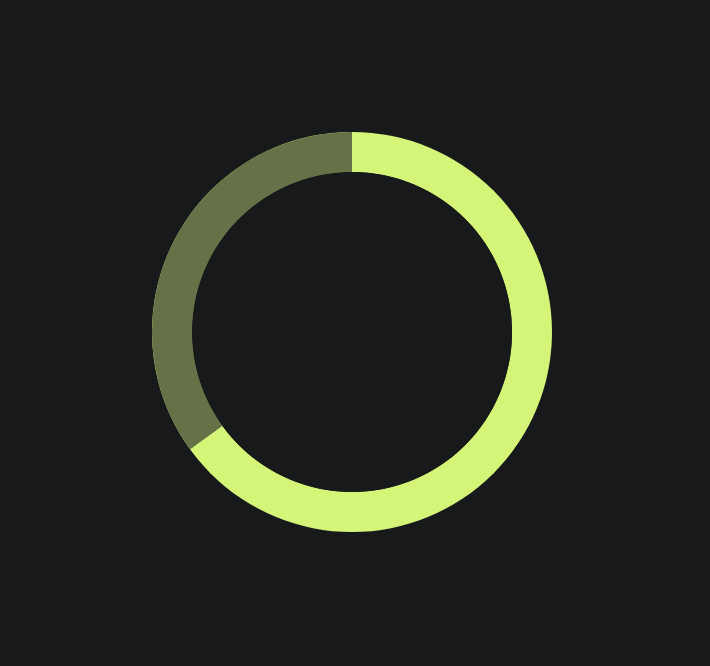

[](https://badge.fury.io/js/st-ring-chart)
# Ring Chart

Simple Ring-Chart/Pie-Chart angular component with 1 or more sections (see [demo](https://shimital.github.io/ring-chart/))



## Getting started

### Install 
#### NPM
`npm install --save st-ring-chart`

#### YARN

`yarn add st-ring-chart`

#### Import The Ring Chart module
```js
import { RingChartModule } from 'st-ring-chart';

@NgModule({
  declarations: [AppComponent],
  imports: [RingChartModule],
  bootstrap: [AppComponent]
})
export class AppModule {}
```

#### See Usage At The Demo Project

## API

| Input  | Type | Default | Required | Description |
| ------------- | ------------- | ------------- | ------------- | ------------- |
| [sections] | `RingSectionItem[]` | `[]` | Yes | represents the chart sections, every section is in the form of: ``` {"color": string, "percentage": number}```. Sum of section percentages must be equal to 1 |
| [thickness] | `number` (px) | 5 | No | The width of the ring. When this number is half or greater the ring diameter it fills the ring entirely and it becomes a pie. |
| [diameter] | `number` (px) | 0 | Yes | The Ring/Pie diameter. |
| [centerColor] | `string` | background | No | The color of the ring center. It is recommended to pass this parameter in order to avoid some display artifacts where the sections intersect |


## Development

Run `npm start` for a dev server. Navigate to `http://localhost:4200/`. The app will automatically reload if you change any of the source files.

## Build

Run `ng build` to build the project. The build artifacts will be stored in the `dist/` directory. Use the `--prod` flag for a production build.

## Running unit tests

Run `ng test` to execute the unit tests via [Karma](https://karma-runner.github.io).
